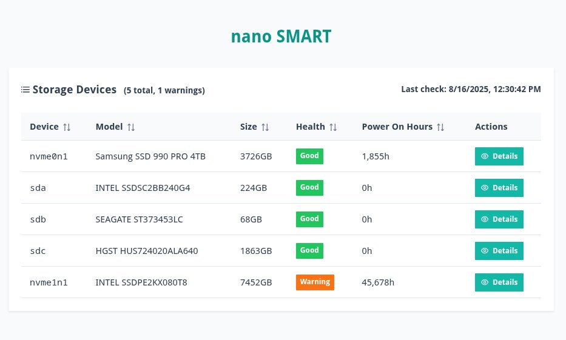
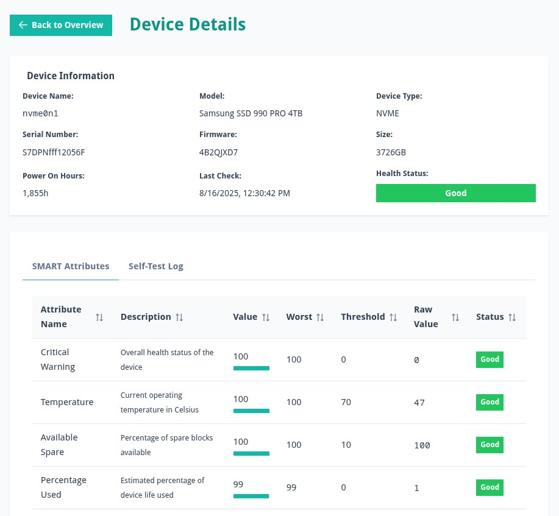

# nanoSmart
micro UI for displaying SMART data

## How it works

nanoSmart is composed of 2 components:

a) a cron script that generates static json files to a specific location
b) an SPA that can consume the static json and represent relevant information